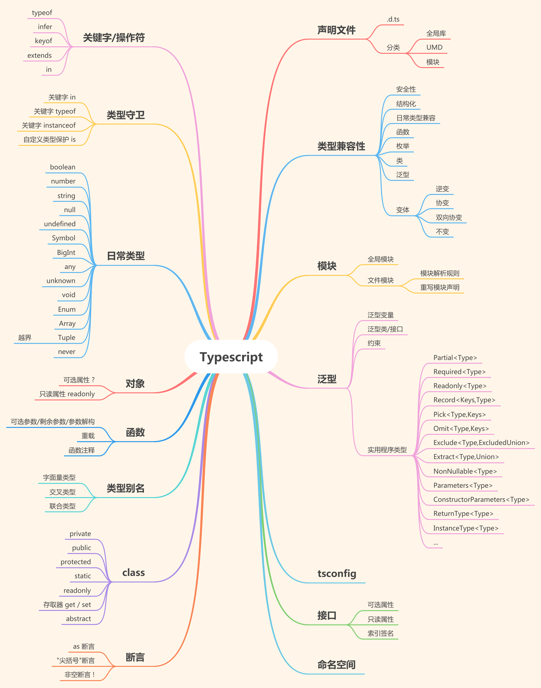

# Getting Started

## 目的

带大家入门 `typescript`, 推荐学习的方式, 增加对 `typescript` 的信心, 最终让大家可以在项目中熟练使用 `typescript`

## 大纲

### 第一部分

-   简介
-   基础部分
    -   基础类型 (boolean、number、string、null, Symbol、undefined)
    -   其他常用类型 unknown、void、never、any、...
    -   枚举 enum
    -   函数
    -   数组, 元组
    -   对象
    -   值类型
    -   接口 interface
    -   类型别名
    -   泛型
    -   模块
-   `vue3` 中使用 `typescript`
-   `tsconfig.json` 配置介绍

### 后续部分

-   类 `class`
-   类型兼容性
-   关键字/操作符
    -   `keyof` | `extends` | `infer` | `in` | `is`
-   映射类型 & 泛型(实用程序类型)
    -   `Partial` | `Required` | `Pick` |....
-   命名空间
-   声明文件
